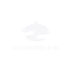

GLUTEN FREE & ME
======

**[Code Institute](https://learn.codeinstitute.net/ci_program/diplomainsoftwaredevelopment)  Milestone Project 3: Backend Development**

 

GLUTEN FREE & ME is a site for those who suffer from Gluten intolerance, to enable recipe sharing so that those with a gluten tolerance still have a varied diet.  The site's primary goal is to enable sharing of recipes and creation of a community.  When you are logged in, you can add, edit and delete your own recipes.
This project will embed learnings around HTML, CSS, JavaScript and Python.

Demo
======

**

UX
**
* [**_User stories_**](#user-stories)
    * [_Strategy_](#strategy)
    * [_Scope_](#scope)
    * [_Structure_](#structure)
    * [_Wireframes_](#wireframes)

**

Features
**
* [**_Existing Features_**](#existing-features)
* [**_Features for the future_**](#features-for-the-future)

**

Technologies
**
* [**_Languages_**](#languages)
* [**_Libraries and frameworks_**](#libraries-and-frameworks)
* [**_Wireframes_**](#wireframes)
* [**_Tools_**](#tools)

**

Testing and Bugs
**
* [**_Testing file_**](#testing-file)

**

Deployment
**
* [**_Deployment_**](#deployment)

**

Credits
**
* [**_Content_**](#content)
* [**_Code_**](#code)
* [**_Media_**](#media)
* [**_Other_**](#other)
* [**_Acknowledgements_**](#acknowledgements)

 

<a href="#top">🔝</a>

UX
======

This is a website aimed at visitors who suffer from gluten intolerances and want to widen their daily menu, broadening their recipes.  It also will enable vistors to share their favourite recipes and build a community

### User stories

##### Visitor Goals

- To create an account and log in on that account.
- To create, read, update and delete my own recipes.
- To be able to see different recipes and search for them using keywords.

##### Site Owners Goals

- Share everyday Gluten free recipes that can be reused within the comminity.
- To promote that having an intolerance can be supported within everyday life.

### Strategy

The design goal is to make a clear, accessible, structured site so that visitors can easily see the recipes, navigate on the site and add, edit and delete their own recipes.  This should be responsive on all device types.

### Scope

The site will have:
- A homepage with a small introduction. 
- An about page which tells a bit about the creator of the site and why the site was created. Furthermore,
- A recipes page on which you can you choose to go to a specific recipe. 
- A register page, a log in page, a personal recipe page and a add recipe page.
The personal recipe page, add recipe page and the log out option will only be visible when you are logged in.

| Sidenav | Logged in User | Logged out User |
 --- | --- | ---
Home| &#9989; | &#9989; |
About |&#9989; | &#9989; |
Recipes|&#9989; | &#9989; |
Register| &#10060; | &#9989; |
Log in| &#10060; | &#9989; |
Personal recipe page| &#9989; | &#10060; |
Add recipe| &#9989; | &#10060; |
Log out| &#9989; | &#10060; |

Also on the homepage there is a difference in what you will see when you are logged in or logged out.

| Homepage | Logged in User | Logged out User |
 --- | --- | ---
Register button | &#10060; | &#9989; |
Log in button  | &#10060; | &#9989; |

A difference has also been made in user rights:
| Recipe options | Standard User Account | Admin User Account |
 --- | --- | ---
Add own recipe| &#9989; | &#9989; |
Edit own recipe | &#9989; | &#9989; |
Delete own recipe | &#9989; | &#9989; |
Edit recipes of other users| &#10060; | &#9989; |
Delete recipes of other users| &#10060; | &#9989; |

### Structure

The site will be structured as clear as possible, it should be easy to see what you can do on the page, responsive on all screen sizes.  It should be clear what you can do on each part of the site. 

### Wireframes

- Desktop wireframe [file](static/img/desktop.png)
- Mobile wireframe [file](static/img/mobile-app.png)
- Ipad wireframe [file](static/img/ipad.png)

Features
======

### Existing Features

The site contains the following features: 

- See an overview of multiple recipes.
- Select a specific recipe and see the details of that recipe.
- Have clear and easy to use page navigation.
- Register an account.
- Log in to that account and log out of it.
- Add, edit and delete your own recipes.

### Features for the future 

The following items can be added: 

- Comment on other people’s recipes.
- Being able to share a recipe on social media.
- Being able to print out a recipe directly from the site with one click on a button. 

Technologies
======

### Languages

- HTML
- CSS
- Python
- JavaScript

### Libraries and Frameworks

- Materialize 1.0.0
- jQuery
- PyMongo
- Flask
- Jinja
- Werkzeug

### Wireframes
- Balsamiq (https://balsamiq.cloud/)

### Tools

- [Canvas](https://www.canva.com/): to resize images and create a company logo.
- [VSCode](https://code.visualstudio.com/): to write the code in.
- [MongoDB Atlas](https://www.mongodb.com/): as a database for this project.
- [Heroku](https://www.heroku.com/): as a host for the deployed site.
- [GitHub](https://github.com/): for the repository.

Testing and Bugs 
======

Deployment
======

### Deployment

Credits
======

### Content

### Code:

1. [Code Institute LMS Backend Development Task Manager Miniproject by Tim Nelson](https://learn.codeinstitute.net/courses/course-v1:CodeInstitute+DCP101+2017_T3/courseware/9e2f12f5584e48acb3c29e9b0d7cc4fe/054c3813e82e4195b5a4d8cd8a99ebaa/) this was used as the basis of the code and then modified to make it my own site.
2. [W3schools](https://www.w3schools.com/howto/howto_js_collapsible.asp) to help me make a collapsible with HTML and JavaScript.
3. [W3schools](https://www.w3schools.com/howto/howto_js_scroll_to_top.asp) to help me make a scroll back to the top button.
4. [Autoprefixer CSS](https://autoprefixer.github.io/) to optimize the use of vendor extensions in the CSS code.
5. [Python Programming](https://pythonprogramming.net/decorator-wrappers-flask-tutorial-login-required/) as how to use the Login_Required decorator.

### Media 

#### Images

### Other

1. [RandomKeygen](https://randomkeygen.com/) to get a value for the secret key.
2. [cdnjs](https://cdnjs.com/) to get the fontawesome cdn from.
3. [jQuery](https://code.jquery.com/) to get the jQuery cdn from.
4. [Am I Responsive?](http://ami.responsivedesign.is/) to check the responsiveness and make the mockups.
5. [WebAIM](https://webaim.org/resources/contrastchecker/) used for checking contrasts on the site.

### Acknowledgements

- My mentor and tutors from Code Institute guiding me through each stage of this project.
- Fellow slack team members.