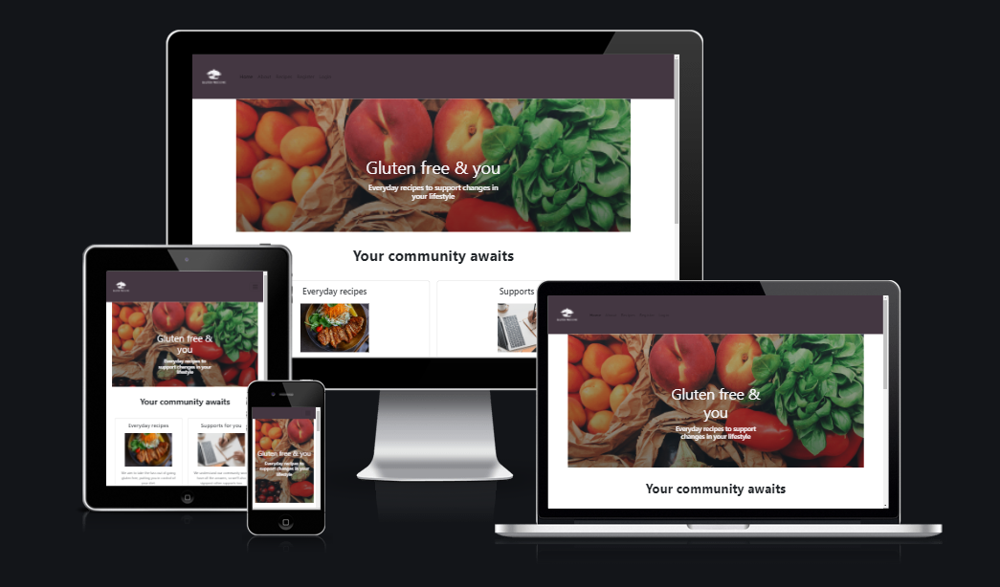

GLUTEN FREE & ME
======
**Milestone Project 3: Backend Development**
[Click here to view live site](https://gluten-free-and-me.herokuapp.com/) 

 

GLUTEN FREE & ME is a site for those who suffer from Gluten intolerance, to enable recipe sharing so that those with a gluten tolerance still have a varied diet.  The site's primary goal is to enable sharing of recipes and creation of a community.  When you are logged in, you can add, edit and delete your own recipes.
This project will embed learnings around HTML, CSS, JavaScript and Python.

On this page 
======

**

UX
**
* [**_User stories_**](#user-stories)
    * [_Strategy_](#strategy)
    * [_Scope_](#scope)
    * [_Structure_](#structure)
    * [_Wireframes_](#wireframes)

**

Features
**
* [**_Existing Features_**](#existing-features)
* [**_Features for the future_**](#features-for-the-future)

**

Technologies
**
* [**_Languages_**](#languages)
* [**_Libraries and frameworks_**](#libraries-and-frameworks)
* [**_Wireframes_**](#wireframes)
* [**_Tools_**](#tools)

**

Testing and Bugs
**
* [**_Testing file_**](#testing-user-stories)
* [**_Bugs identified & corrected_**](#bugs-identified-and-corrected)
* [**_Bugs identified & uncorrected_**](#bugs-identified-and-uncorrected)

**

Deployment
**
* [**_Deployment_**](#deployment)

**

Credits
**
* [**_Content_**](#content)
* [**_Code_**](#code)
* [**_Media_**](#media)
* [**_Other_**](#other)
* [**_Acknowledgements_**](#acknowledgements)

 

<a href="#top">🔝</a>

UX
======

This is a website aimed at visitors who suffer from gluten intolerances and want to widen their daily menu, broadening their recipes.  It also will enable vistors to share their favourite recipes and build a community

### User stories

##### Visitor Goals

- As a user I want to easily access recipes 
- As a user I want to search recipes easily 
- As a user I want to create an account and log in on that account to add my own recipes
- As a user I want to create, read, update and delete my own recipes
- As a user I want to be able to see different recipes and search for them using keywords.

##### Site Owners Goals

- Share everyday Gluten free recipes that can be reused within the community.
- Promote that having an intolerance can be supported within everyday life.
- Signpost external supports that may add value to vistors transitioning to a gluten free diet.

### Strategy

The design goal is to make a clear, accessible, structured site so that visitors can easily see the recipes, navigate on the site and add, edit and delete their own recipes.  This should be responsive on all device types.

### Scope

The site will have:
- A homepage with a small introduction. 
- An about page which tells a bit about the creator of the site and why the site was created. 
- A recipes page on which you can you choose to go to a specific recipe. 
- A register page, a log in page, a personal recipe page and a add recipe page.
The personal recipe page, add recipe page and the log out option will only be visible when you are logged in.

| Sidenav | Logged in User | Logged out User |
 --- | --- | ---
Home| &#9989; | &#9989; |
About |&#9989; | &#9989; |
Recipes|&#9989; | &#9989; |
Register| &#10060; | &#9989; |
Log in| &#10060; | &#9989; |
Personal recipe page| &#9989; | &#10060; |
Add recipe| &#9989; | &#10060; |
Log out| &#9989; | &#10060; |

Also on the homepage there is a difference in what you will see when you are logged in or logged out.

| Homepage | Logged in User | Logged out User |
 --- | --- | ---
Register button | &#10060; | &#9989; |
Log in button  | &#10060; | &#9989; |

### Structure

The site will be structured as clear as possible, it should be easy to see what you can do on the page, responsive on all screen sizes.  It should be clear what you can do on each part of the site. 

### Wireframes

- Desktop wireframe [file](static/img/testing/desktop.png)
- Mobile wireframe [file](static/img/testing/mobile-app.png)
- Ipad wireframe [file](static/img/testing/ipad.png)

Features
======

### Existing Features

The site contains the following features: 

- See an overview of multiple recipes.
- Select a specific recipe and see the details of that recipe.
- Have clear and easy to use page navigation.
- Register an account.
- Log in to that account and log out of it.
- Add, edit and delete your own recipes.

### Features for the future 

The following items can be added: 

- Ability to add more than one recipe per user - current platform is considered MVP.
- Comment on other people’s recipes.
- Being able to share a recipe on social media.
- Being able to print out a recipe directly from the site with one click on a button. 
- Tiered levels of access, with the opportunity to partner with third parties and provide a subscription service.

Technologies
======

### Languages

- HTML
- CSS
- Python
- JavaScript

### Libraries and Frameworks

- Flask 
- Flask-PyMongo 
- pip
- dnspython 
- Materialize
- jQuery
- PyMongo
- Flask
- Jinja
- Werkzeug
- Font Awesome

### Wireframes
- Balsamiq (https://balsamiq.cloud/)

### Tools

- [Canvas](https://www.canva.com/): to resize images and create a company logo.
- [VSCode](https://code.visualstudio.com/): to write the code in.
- [MongoDB Atlas](https://www.mongodb.com/): as a database for this project.
- [Heroku](https://www.heroku.com/): as a host for the deployed site.
- [GitHub](https://github.com/): for the repository.
- [Am I Responsive](http://ami.responsivedesign.is/#): used to create the mockup image in the beginning of this README file..
- [W3C Markp Validation Service](https://validator.w3.org/):  used to check the HTML pages.
- [PEP8 online](http://pep8online.com/): used to check the app.py file.
- [Coolors](https://coolors.co/): used to create colour palette.
- [Tinypng](https://tinypng.com/): used to compress images.
- [Lighthouse](https://developers.google.com/web/tools/lighthouse): used to improve performance.
- [JSHint](https://jshint.com/): used to check .js files.

Testing and Bugs 
======

### Testing User Stories

- As a user can I easily navigate to the website from Google 
Lighthouse recommendations implemented and website scoring 100 on SEO elements [shown here](static/img/testing/lighthouse-summary-post-change.png)

- As a user can I easily navigate to the recipes section, and progress through out the website 
 As a user I can view when recipes are available [shown here](static/img/testing/recipe-summary-results.png)
 As a user I can see when no recipes are available [shown here](static/img/testing/recipe-summary-none.png)

- As a user can I search recipes available with ease
 As a user I can view when recipes are available [shown here](static/img/testing/recipe-summary-results.png)
 As a user I can see when no recipes are available [shown here](static/img/testing/recipe-summary-none.png)

- As a user can I register for your website with ease
 As a user I could register with ease via [this screen](static/img/testing/register-screen.png)
 As a user when I register the navigation and landing page updates as [shown here](static/img/testing/add-a-recipe.png)

- As a user can I add recipes with ease 
 As a user I could register with ease via [this screen](static/img/testing/add-recipe-form.png)

- As a user can I amend or delete my own recipes with ease
 As a registered user I could amend a recipe with ease via [this screen](static/img/testing/edit-recipe-form.png)
 As a registered user when I amended a recipe I got confimation as [shown here](static/img/testing/amend-recipe.png)
 As a registered user before I delete a recipe, I got a popup to makesure this wasnt in error [shown here](static/img/testing/delete-modal.png)
 As a registered user when I delete a recipe, I got confirmation [shown here](static/img/testing/delete-recipe-confirmation.png)

- As a user can I login to my account with ease 
 As a registered user I could login provided I knew my details using [this screen](static/img/testing/login-screen.png)

- As a user can I easily provide feedback to improve the website
 As a user I could leave feedback on [this screen](static/img/testing/feedback-form.png), however the confirmation receipt wasnt user friendly as [seen here](static/img/testing/feedback-confirmation.png)

- As a user if I navigate to the website incorrectly, or there is a server error will I be advised
When navigating to a page which didnt exist I received a 404 error which brought me back to the main site as [seen here](static/img/testing/404-error.png)

- As a user I won't experience any delayed latency or unresponsive elements
All elements tested above, in addition to Lighthouse, CSS and Python error checking

### Bugs identified and corrected

- Recommendations made from Lighthouse which uplifted performance +3 points.
 Lighthouse output prechange [file](static/img/testing/lighthouse-summary.png)
 Lighthouse output postchange  [file](static/img/testing/lighthouse-summary-post-change.png)

- When registering to add a recipe, email address is only accepted, this is then shared across the website if you add a recipe.  Updated to accept username.
 Recipe summary [here](static/img/testing/recipe-summary.png)shows email address displayed for username

- When searching for a recipe, users couldnt easily reset search results 

### Bugs identified and uncorrected

- Remaining errors within [app.py](static/img/testing/py-file-output.png) file are deemed false positive.  

Deployment
======

### Create Project  

This project was created on Github using the following steps: 
1. Navigate to [GitHub](https://github.com/) and sign in
2. On the left hand side above the list of your repositories click on the green button that says "New", this will create a new repository
3. From the drop down menu that says "Repository templates" I choose the Code Institute Template  
4. Enter a name for the project and then click on the green button that says "Create Repository"

Before creating the Heroku app you need to add the following files in Gitpod:

 - To create your requirements file, type this in the terminal:
    - pip3 freeze --local > requirements.txt
- To create your Procfile, type this in the terminal:
    - echo web: python run.py > Procfile 

In the Procfile make sure it contains the following line: web: python app.py, and that it is no blank line after it.

### Deployment to Heroku  

This project was deployed through Heroku using the following steps:
1. Navigate to [Heroku](https://dashboard.heroku.com/login) and sign in
2. On the top right corner there is a button that says "New". Click this button and choose the option "Create New App"
3. Choose a name for the App and what region that are closest to your location, click "Create App"
4. Click on the tab saying "Deploy" and select GitHub, Connect to GitHub
5. Enter the name of your repository on GitHub and click search
6. When the repository is found, click the "Connect" button
7. Click on the tab saying "Settings" and then click on the button saying "Reveal config vars"

8. Add these variables:

    key: IP, value: 0.0.0.0  
    key: MONGODB_NAME, value: (the name of your database) 
    key: MONGO_URI, value: (unique uri from mongo.db) 
    key: PORT, value: 5000 
    key: SECRET_KEY, value: (unique secret key for configuration) 

9. Click on the "Deploy" tab and scroll down to the section "Automatic Deployment"
10. Choose the branch you want to deploy from and then click "Enable Automatic Deploys"

### How To Run The Code Locally  

To run this project locally you need to create the env.py file using your own variables since these are not provided for security reasons. To have the database connection you'll also need to create your own database collection on MongoDB and connect it to your project.

1. Log in to Github.
2. Navigate to the [repository](https://github.com/mccannka/gluten-free-me)
3. Click the tab that says "Code" and from the dropdown menu choose copy Git URL
4. Open Git and type "git clone" in the terminal followed by the URL you just copied, press enter to create your local clone
5. To install the packages listed in the requirements file type the following in the terminal: 
pip install -r requirements.txt

### Fork Project  

To fork the project follow these steps:

1. Log in to Github
2. Navigate to the [repository](https://github.com/mccannka/gluten-free-me)
3. Locate the "Fork" button on the top right corner of the page
4. A duplicate of the original repository is now in your Github account

---

Credits
======

### Content

### Code:

1. [Code Institute LMS Backend Development Task Manager Miniproject by Tim Nelson](https://learn.codeinstitute.net/courses/course-v1:CodeInstitute+DCP101+2017_T3/courseware/9e2f12f5584e48acb3c29e9b0d7cc4fe/054c3813e82e4195b5a4d8cd8a99ebaa/) this was used as the basis of the code and then modified to make it my own site.
2. [W3schools](https://www.w3schools.com/howto/howto_js_collapsible.asp) to help me make a collapsible with HTML and JavaScript.
3. [W3schools](https://www.w3schools.com/howto/howto_js_scroll_to_top.asp) to help me make a scroll back to the top button.
4. [Autoprefixer CSS](https://autoprefixer.github.io/) to optimize the use of vendor extensions in the CSS code.
5. [Python Programming](https://pythonprogramming.net/decorator-wrappers-flask-tutorial-login-required/) as how to use the Login_Required decorator.

### Media 

#### Images

### Other

1. [RandomKeygen](https://randomkeygen.com/) to get a value for the secret key.
2. [cdnjs](https://cdnjs.com/) to get the fontawesome cdn from.
3. [jQuery](https://code.jquery.com/) to get the jQuery cdn from.
4. [Am I Responsive?](http://ami.responsivedesign.is/) to check the responsiveness and make the mockups.
5. [WebAIM](https://webaim.org/resources/contrastchecker/) used for checking contrasts on the site.

### Acknowledgements

- My mentor and tutors from Code Institute guiding me through each stage of this project.
- Fellow slack team members.